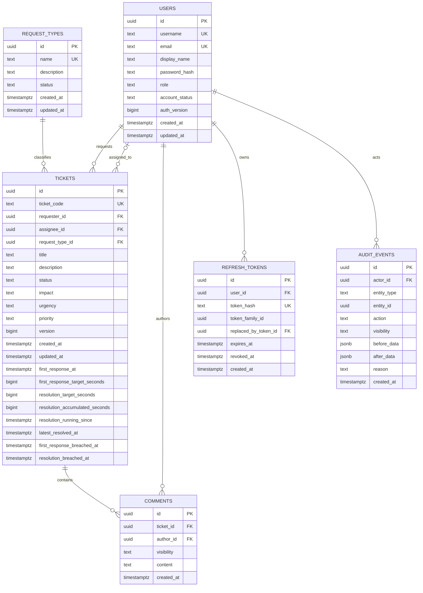

# OpsFlow Data Model v1 — T0.1

**PIC:** LocLD11 · **Reviewer:** PhanDV2 · **Trạng thái:** thiết kế để review, chưa phải migration hay implementation.
**Phạm vi:** PostgreSQL cho một công ty/một đội IT Support; sáu bảng nghiệp vụ và xác thực bên dưới. T0.3/T1.1/T3.1/T8.1 hiện chưa có code hoặc migration để đối chiếu. Không suy rằng prototype `frontend/src/mocks/` là schema backend.

## Nguồn và quyết định ưu tiên

1. `docs/QA_Management_v1.0.md`: Q&A #1–#7, #10–#12, #14, #16–#23 đã Close là nguồn business rule; #24 trống.
2. `docs/OpsFlow_Product_Backlog_v1.0.md`: T0.1 và AC của US01–US08, US10–US12, US18–US21, US22–US29; đặc biệt T1.1, T2.1, T3.1, T8.1, T10.1–T10.4, T13.1–T13.4.
3. `docs/OpsFlow_De_xuat_ky_thuat_va_to_chuc_du_an.md`: mục 4–5.1 cho auth, transaction, optimistic locking, sáu bảng sơ bộ và SLA.
4. `docs/OpsFlow_WBS.md`: T0.1 do LocLD11 phụ trách, T3.1 do PhanDV2 phụ trách; `docs/OpsFlow_Requirement_Brief.md`: FR01–FR10 và phạm vi MVP.

Backlog/WBS T0.1 gọi tên `Role` và `History` trong danh sách mô hình sơ bộ. Q&A #21 chốt **mỗi User đúng một role**, còn đề xuất kỹ thuật ghi `users.role`; Q&A #11/Backlog US20 và đề xuất kỹ thuật chọn audit chung. Vì vậy v1 dùng **`users.role` có ràng buộc giá trị**, không có bảng `roles`/bảng nối user-role; Ticket History lấy từ **`audit_events`**, không có `ticket_history`. Đây là quyết định mô hình cần PhanDV2 review cùng các task phụ thuộc, không phải thay đổi business rule.

## ERD

Nguồn Mermaid độc lập: [erd-v1.mmd](erd-v1.mmd). Sơ đồ biểu diễn FK thật; quan hệ `audit_events.(entity_type, entity_id)` với ba loại đối tượng là liên kết đa hình logic nên được mô tả ở phần Audit thay vì vẽ như FK.

## Kiểu dữ liệu và bảng

Chọn `uuid` cho ID nội bộ của cả sáu bảng để thống nhất FK và `audit_events.entity_id`; backend sinh ID khi tạo. `ticket_code` là mã hiển thị riêng, unique; format/cách cấp số thuộc T3.1, không suy từ dữ liệu mock. Thời điểm dùng `timestamptz` lưu instant; hiển thị/kỳ báo cáo theo giờ Việt Nam ở service. Các chuỗi enum dưới đây lưu dạng text/varchar với `CHECK` hoặc ràng buộc tương đương ở migration T0.3; không dùng giá trị mock ngoài danh sách PO chốt.

| Bảng | Cột và nullability đề xuất | Ràng buộc/ý nghĩa |
| --- | --- | --- |
| `users` | `id`, `username`, `display_name`, `password_hash`, `role`, `account_status`, `auth_version`, `created_at`, `updated_at` **NOT NULL**; `email` NULL. | `id` PK. `username` unique; `email` unique khi được cung cấp, cả hai không phân biệt chữ hoa/thường sau chuẩn hóa. US02 bắt buộc Username, chưa bắt buộc mỗi tài khoản phải có email; T1.1/T1.2 xác nhận login bằng username/email. Không tái sử dụng định danh của tài khoản đã khóa. `role` chỉ `EMPLOYEE`, `SUPPORT_AGENT`, `ADMINISTRATOR`; `account_status` chỉ `ACTIVE`, `LOCKED`, mặc định ACTIVE. `auth_version` bigint ≥0, mặc định 0, tăng khi khóa/đổi role/đổi-reset password. Chỉ lưu password hash, không lưu password gốc. |
| `request_types` | `id`, `name`, `status`, `created_at`, `updated_at` **NOT NULL**; `description` NULL. | `id` PK; `name` unique không phân biệt chữ hoa/thường sau chuẩn hóa. `status` `ACTIVE`/`INACTIVE`, mặc định ACTIVE. Ticket cũ giữ FK khi danh mục inactive hoặc đổi tên; API create/edit chỉ nhận loại ACTIVE (US03). |
| `tickets` | `id`, `ticket_code`, `requester_id`, `request_type_id`, `title`, `description`, `status`, `impact`, `urgency`, `priority`, `version`, `created_at`, `updated_at`, `first_response_target_seconds`, `resolution_target_seconds`, `resolution_accumulated_seconds` **NOT NULL**. `assignee_id`, `first_response_at`, `resolution_running_since`, `latest_resolved_at`, `first_response_breached_at`, `resolution_breached_at` NULL theo trạng thái. | `id` PK; `ticket_code` unique. `requester_id` → `users.id`; `assignee_id` → `users.id`; `request_type_id` → `request_types.id`. Một cột `assignee_id` tạo tối đa **một** Agent chính; NEW có thể NULL hoặc đã assign. IN_PROGRESS/WAITING_FOR_EMPLOYEE bắt buộc assignee. `version` bigint ≥0, mặc định 0; thời gian tích lũy bigint ≥0, mặc định 0. |
| `comments` | `id`, `ticket_id`, `author_id`, `visibility`, `content`, `created_at` **NOT NULL**. | `id` PK; `ticket_id` → `tickets.id`, `author_id` → `users.id`. `visibility` chỉ `PUBLIC`/`INTERNAL`; `content` không rỗng sau trim. Comment bất biến: không sửa/xóa/đổi visibility. Không có attachment trong MVP bắt buộc. |
| `refresh_tokens` | `id`, `user_id`, `token_hash`, `token_family_id`, `expires_at`, `created_at` **NOT NULL**; `revoked_at`, `replaced_by_token_id` NULL. | `id` PK; `user_id` → `users.id`; `token_hash` unique. `replaced_by_token_id` → `refresh_tokens.id` (self-FK) khi rotation. Chỉ lưu **hash**, không lưu raw token. Family ID dùng revoke cả family khi phát hiện reuse; token cũ được revoke trong cùng transaction cấp token mới. |
| `audit_events` | `id`, `actor_id`, `entity_type`, `entity_id`, `action`, `visibility`, `created_at` **NOT NULL**; `before_data`, `after_data` JSONB và `reason` có thể NULL theo action. | `id` PK; `actor_id` → `users.id`. `entity_type` chỉ `TICKET`, `USER`, `REQUEST_TYPE` trong v1; `entity_id` là ID bảng tương ứng nhưng **không có FK đa hình**. `visibility` `PUBLIC`/`INTERNAL`: Employee chỉ nhận public event của ticket mình; Agent/Admin theo Q&A #11. Audit append-only và không chứa password hash, token, secret hoặc nội dung internal trong event public. |

### Ticket và SLA

- `status`: `NEW`, `IN_PROGRESS`, `WAITING_FOR_EMPLOYEE`, `RESOLVED`, `CLOSED`, `CANCELLED`; không có Pending Vendor/Rejected. `impact`/`urgency`: `HIGH`, `MEDIUM`, `LOW`; `priority`: `P1`–`P4`, tính từ ma trận Q&A #7 ở backend, không nhận từ payload. Title dài **5–255** và description **10–5000** ký tự theo US04. Không tự thêm affected user, department FK, assignee list hoặc delete flag.
- `first_response_at` được ghi **một lần** tại public comment hợp lệ đầu tiên của Agent phụ trách/Admin; Take, status change và internal note không ghi mốc này. Đồng hồ bắt đầu tại `created_at`, không reset khi reopen. `resolution_running_since` khởi tạo bằng `created_at` khi NEW; NULL khi pause ở WAITING_FOR_EMPLOYEE/RESOLVED hoặc dừng ở CLOSED/CANCELLED. Mỗi lần pause, cộng khoảng đang chạy vào `resolution_accumulated_seconds`; khi resume/reopen, gán mốc chạy mới mà không xóa tổng cũ. `latest_resolved_at` cập nhật khi Resolve thành công và giữ mốc gần nhất; dashboard phải lọc thêm **trạng thái hiện tại** RESOLVED/CLOSED (Q&A #12, #22).
- `first_response_target_seconds` và `resolution_target_seconds` giữ target hiệu lực của từng mục tiêu (khởi tạo từ priority P1–P4 theo Q&A #12). Khi priority đổi, cập nhật target của mục tiêu **chưa đạt**; target First Response đã đạt được giữ để không diễn giải lại kết quả lịch sử. Resolution target giữ nguyên elapsed qua pause/reopen, và có thể đổi khi objective lại đang xử lý theo quyền Q&A #7. Cả hai target >0. T10 phải đối soát chuyển trạng thái/đổi priority với chính sách SLA đã chốt trước khi code engine.
- `first_response_breached_at` và `resolution_breached_at` là thời điểm **ghi nhận lần vi phạm đầu tiên** của từng mục tiêu; NULL nghĩa là chưa ghi nhận vi phạm. Không xóa khi đổi priority/reassign/reopen. Query filter “từng vi phạm SLA” dùng giá trị non-NULL. Khi priority đổi, T10 phải xét elapsed/target và ghi nhận breach đã có trước khi áp target mới trong cùng transaction. Mốc ghi nhận có thể muộn hơn thời điểm toán học vượt ngưỡng nếu không có scheduler; T10 chốt cơ chế phát hiện và kiểm thử. Đây là dữ liệu hỗ trợ SLA, **chưa phải SLA Engine**.
- First Response và Resolution tính 24/7; Waiting chỉ pause **Resolution**, không pause First Response. Không suy thời gian giải quyết bằng `now - created_at`.

### Quan hệ và dữ liệu lịch sử

- Một User tạo nhiều Ticket; một Ticket có đúng một requester và tối đa một assignee. Một Request Type gắn nhiều Ticket; một Ticket dùng đúng một Request Type. Một Ticket có nhiều Comment; mỗi Comment có đúng một author. Một User có nhiều Refresh Token và Audit Event với tư cách actor. `replaced_by_token_id` là quan hệ self-reference tùy chọn.
- `audit_events.(entity_type, entity_id)` lưu đối tượng bị tác động, không thể tạo một FK chuẩn đến ba bảng. Service phải xác minh đối tượng, ghi audit cùng transaction với thay đổi; không hard-delete đối tượng để `entity_id` luôn truy xuất được. Khi query Ticket History dùng `entity_type='TICKET' AND entity_id=:ticketId`; không cần bảng `ticket_history` riêng. Sự kiện quản trị User/Request Type ở cùng bảng. `visibility` và projection/API phải lọc dữ liệu để Internal Note hoặc event nội bộ không rò sang Employee (Q&A #10–#11, US20).
- Với Wait/Resolve/Cancel/Reassign/Priority change, Ticket, SLA, Comment bắt buộc và Audit Event ghi **cùng transaction**. Audit before/after chỉ chứa field cần đối soát và phải được lọc/redact theo visibility; không dump entity chứa `password_hash` hoặc `token_hash`.

## Constraint và index đề xuất cho T0.3/T3.1

| Nhóm | Quy tắc |
| --- | --- |
| PK/FK | Sáu PK `uuid`; FK nêu ở bảng trên, `ON DELETE RESTRICT`/`NO ACTION` cho dữ liệu nghiệp vụ; không cascade xóa Ticket/Comment/Audit/User/Request Type. `refresh_tokens.replaced_by_token_id` nullable self-FK, cần xử lý thứ tự ghi khi rotation. |
| Unique | `tickets.ticket_code`, `refresh_tokens.token_hash`; unique index trên `lower(users.username)`, `lower(users.email)` với giá trị email có mặt, `lower(request_types.name)` sau trim/normalization ở service. Không dùng email hoặc ticket code làm PK. |
| Check | Enum role/status/visibility/entity_type, `auth_version >= 0`, `tickets.version >= 0`, `resolution_accumulated_seconds >= 0`, hai SLA target >0; `status IN ('IN_PROGRESS','WAITING_FOR_EMPLOYEE')` ⇒ `assignee_id IS NOT NULL`; `expires_at > created_at`; title/description length và nonblank theo US04. Các check chi tiết sẽ chuyển thành SQL trong T0.3/T3.1 sau review. |
| Ticket list/search | B-tree `(requester_id, created_at DESC, id)`, `(assignee_id, status, created_at DESC, id)`, `(status, created_at DESC, id)`, `(request_type_id)`, `(priority)`, `(status, latest_resolved_at)` cho dashboard; `ticket_code` unique index đáp ứng exact search. Partial title search cần chọn cách index sau khi T9 xác định query/performance trên Supabase, không tự yêu cầu extension trong baseline. |
| Communication/audit/auth | `comments(ticket_id, created_at, id)`; `audit_events(entity_type, entity_id, created_at, id)` và `(actor_id, created_at)`; `refresh_tokens(user_id, revoked_at, expires_at)` và `(token_family_id)` để revoke family. FK được index nếu có query/join thường xuyên. |

Các invariant cần **backend enforce trong transaction** vì FK/CHECK đơn giản không đủ: requester phải có role EMPLOYEE; assignee phải là SUPPORT_AGENT còn ACTIVE; Agent đang có Ticket mở phải được reassign trước khi khóa/đổi role; không khóa/hạ quyền Admin cuối cùng; Request Type phải ACTIVE lúc tạo/sửa; permission và transition matrix; priority theo impact × urgency; lần phản hồi đầu hợp lệ; comment visibility; duplicate submit. `version` dùng optimistic locking: mutation gửi `expectedVersion`, update thành công tăng `version` đúng một lần và trả version mới; nếu không khớp, rollback và trả 409 `STALE_TICKET`, không ghi comment/audit/SLA dở dang (Q&A #23, US29). T12.1 còn cần chốt cách lưu idempotency cho request tạo Ticket/Comment; thiết kế v1 không tuyên bố version check một mình ngăn được mọi duplicate submit.

## Quy tắc lưu giữ và các điểm review

Không hard-delete User đã có lịch sử, Ticket, Comment, Audit Event hoặc Request Type đang/đã được Ticket sử dụng. Dùng `users.account_status=LOCKED`, `request_types.status=INACTIVE`, `tickets.status=CANCELLED` khi hợp lệ. Refresh Token revoke/rotation là dữ liệu phiên; chính sách dọn token hết hạn do T1.2/vận hành xác định riêng, không ảnh hưởng audit nghiệp vụ. Mọi migration do Flyway quản lý ở T0.3; tài liệu này **không tạo migration, JPA Entity, Repository hoặc SLA Engine**.

PhanDV2 cần review trước T0.3/T3.1: (1) `users.role` thay bảng Role, `audit_events` thay Ticket History; (2) UUID nội bộ và quy tắc cấp `ticket_code`; (3) FK/nullability, một assignee và invariant theo trạng thái; (4) hai target snapshot, hai breach timestamp và độ chính xác phát hiện trong T10; (5) visibility của audit JSON và danh sách index; (6) cơ chế idempotency của T12.1. Mọi thay đổi public schema sau khi task phụ thuộc dùng phải có đánh giá tác động và review chéo.
